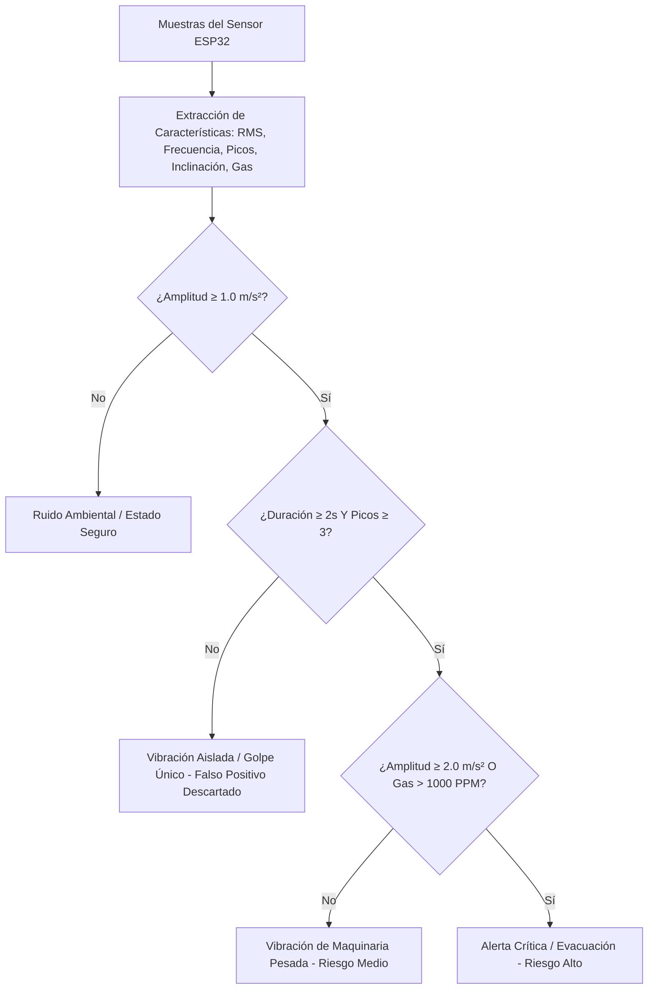

#  Pulso Minero - Monitoreo IoT & IA Explicable para Minería

[](https://flutter.dev)
[](https://dart.dev)
[](https://www.espressif.com/)
[](https://www.arduino.cc/)
[](LICENSE)

> **Sistema inteligente e integral para el monitoreo en tiempo real de vibraciones de maquinaria pesada, estabilidad de taludes/túneles (inclinometría) y seguridad atmosférica (gases mineros) con motor de Inteligencia Artificial Explicable (XAI).**

---

##  Contexto y Escenario Operativo

- **Grupo:** 6
- **Sitio Asignado:** Zona de explotación minera — Monitoreo de vibración por maquinaria pesada (*Ferney Pérez*).
- **Hardware en Vivo:** Acelerómetro de alta sensibilidad **MPU6050** (sustituto digital de geófono) + Inclinómetro de apoyo ($\text{Pitch / Roll}$) + Sensor de calidad de aire y gases **MQ-135** + Microcontrolador **ESP32** (Wi-Fi/BLE).
- **Enfoque de IA:** Algoritmo de **Inteligencia Artificial Explicable (*Explainable AI - XAI*)** que evalúa en tiempo real la señal dinámica, calcula RMS, frecuencia dominante y patrones armónicos para **distinguir vibración continua de maquinaria pesada frente a ruido ambiental y golpes aislados (eliminando falsos positivos)**.

---

##  Características Principales

###  Aplicación Móvil (Flutter)
-  **Osciloscopio Sísmico Multicanal:** Visualización fluida de la curva de aceleración en tiempo real con gradiente adaptativo de riesgo.
-  **Desglose Tridimensional ($X, Y, Z$):** Telemetría continua de los 3 ejes de aceleración y cálculo de magnitud resultante.
-  **Inclinómetro de Estabilidad:** Medición precisa de los ángulos de inclinación (*Pitch*) y balanceo (*Roll*) para prevenir desprendimientos o colapsos de roca.
-  **Monitoreo de Gases Mineros (MQ-135):** Lectura en tiempo real de concentración en **PPM**, voltaje analógico y semáforo de riesgo ambiental (*Normal*, *Precaución*, *Peligro*).
-  **Calibración de Cero (Tara Dinámica):** Botón para descontar la gravedad de reposo ($9.81\text{ m/s}^2$) y registrar únicamente la vibración neta.
-  **Inspector de Telemetría JSON:** Consola integrada para auditar byte a byte la trama cruda transmitida por el ESP32 en vivo.
-  **Diagnóstico Explicable con IA:** Clasificación automática del ensayo con nivel de confianza (%) y justificación en lenguaje natural (*"Por qué"* el sistema tomó la decisión).
-  **Historial y Exportación a CSV:** Registro local persistente de todos los ensayos con generador de reportes técnicos tabulados.

###  Firmware IoT (ESP32)
- **Conectividad Dual:** Servidor TCP/Socket sobre Wi-Fi (Modo Punto de Acceso `PulsoMinero-WiFi` en puerto `81`) y soporte para Bluetooth Low Energy (BLE).
- **Muestreo a 10 Hz:** Transmisión regular de tramas JSON ultraligeras cada 100 ms.
- **Filtro Digital y Alta Sensibilidad:** Rango $\pm 2g$ con filtro pasa-bajos digital (DLPF a $44\text{ Hz}$) para capturar micro-oscilaciones sin ruido eléctrico.
- **Auto-Diagnóstico:** Flags de estado (`mpu_ok`, `mq_ok`) y temperatura interna del chip en $^\circ\text{C}$.

---

##  Arquitectura de Hardware y Conexiones

```
                       ┌────────────────────────────────┐
                       │          PLACA ESP32           │
                       │                                │
  Sensor MPU6050       │                                │        Sensor MQ-135
 ┌──────────────┐      │                                │       ┌──────────────┐
 │          VCC ├──────┤ 3.3V                       VIN ├───────┤ VCC (5V)     │
 │          GND ├──────┤ GND                        GND ├───────┤ GND          │
 │          SCL ├──────┤ GPIO 22 (D22)          GPIO 34 ├───────┤ A0 (Analógico)
 │          SDA ├──────┤ GPIO 21 (D21)                  │       └──────────────┘
 └──────────────┘      └────────────────────────────────┘
```

### Tabla Pin a Pin:

| Sensor | Pin del Sensor | Pin en el ESP32 | Función |
| :--- | :--- | :--- | :--- |
| **MPU6050** | `VCC` | `3.3V` | Alimentación del acelerómetro |
| **MPU6050** | `GND` | `GND` | Tierra común |
| **MPU6050** | `SCL` | `GPIO 22` (`D22`) | Reloj I2C |
| **MPU6050** | `SDA` | `GPIO 21` (`D21`) | Datos I2C |
| **MQ-135** | `VCC` | `VIN` (o `5V`) | Alimentación del calentador interno |
| **MQ-135** | `GND` | `GND` | Tierra común |
| **MQ-135** | `A0` | `GPIO 34` (`D34`) | Entrada analógica ADC1 (Voltaje/PPM) |

---

##  Lógica del Motor de IA Explicable (XAI)

El módulo `AiService` extrae características de la señal en ventanas de tiempo y aplica reglas de inferencia explicables:



### Reglas de Decisión:
1. **Ruido Ambiental:** Amplitud $< 1.0\text{ m/s}^2$, sin periodicidad.
2. **Vibración Aislada:** Amplitud $\ge 1.0\text{ m/s}^2$, pero con duración $< 2\text{ s}$ o picos $< 3$ (*No activa falsas alarmas de operación continua*).
3. **Vibración de Maquinaria Pesada:** Amplitud sostenida $\ge 1.0\text{ m/s}^2$ durante $\ge 2\text{ s}$ con $\ge 3$ ciclos repetitivos.
4. **Alerta Crítica / Peligro:** Amplitud $\ge 2.0\text{ m/s}^2$, inclinación anómala $> 15^\circ$ o concentración de gas $> 1000\text{ PPM}$.

---

##  Formato de Trama de Telemetría JSON (ESP32 $\rightarrow$ App)

```json
{
  "timestamp": 34500,
  "seq": 142,
  "x": 0.0421,
  "y": 0.0815,
  "z": 9.8140,
  "gx": 0.0012,
  "gy": -0.0034,
  "gz": 0.0008,
  "temp": 26.8,
  "inclination": 0.24,
  "roll": 0.47,
  "gas": 420.5,
  "gas_raw": 845,
  "gas_volt": 0.68,
  "mpu_ok": true,
  "mq_ok": true
}
```

---

##  Instalación y Puesta en Marcha

### 1. Cargar el Firmware en el ESP32
1. Abre [esp32/pulso_minero_esp32/pulso_minero_esp32.ino](esp32/pulso_minero_esp32/pulso_minero_esp32.ino) en **Arduino IDE**.
2. Instala la librería **`Adafruit MPU6050`** desde el Gestor de Bibliotecas.
3. Selecciona la placa **ESP32 Dev Module** y el puerto COM.
4. Presiona **Subir (Upload)**.
5. Abre el **Monitor Serie (115200 baudios)** para verificar la creación del Access Point `PulsoMinero-WiFi`.

### 2. Ejecutar la Aplicación Móvil
```powershell
# Obtener dependencias de Flutter
flutter pub get

# Compilar APK para Android
flutter build apk --debug

# O ejecutar directamente en dispositivo conectado
flutter run
```

### 3. Conexión en Campo
1. Conecta tu celular a la red Wi-Fi:
   - **SSID:** `PulsoMinero-WiFi`
   - **Contraseña:** `12345678`
2. Abre la app **Pulso Minero**, ingresa a **Monitoreo en tiempo real**, presiona **Wi-Fi** y dale a **Conectar** (`192.168.4.1`).

---

##  Equipo de Desarrollo / Autores
- **Brayan Alecander Ibarguen Murillo**
- **Juan Pablo Jorge Calderón**
- **Proyecto Pulso Minero - PICUR 2**
- **Grupo 6:** Zona de explotación minera (Vibración por maquinaria pesada - Ferney Pérez).
